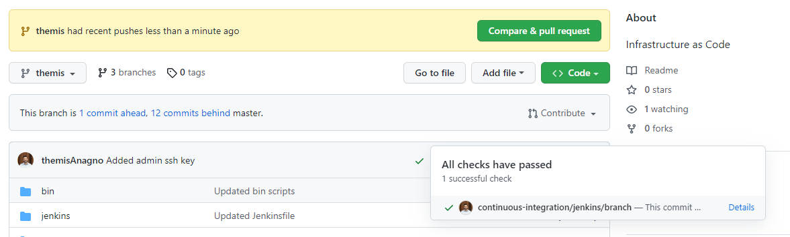
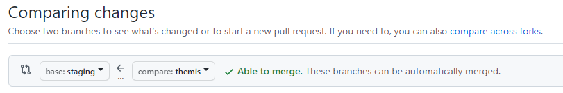
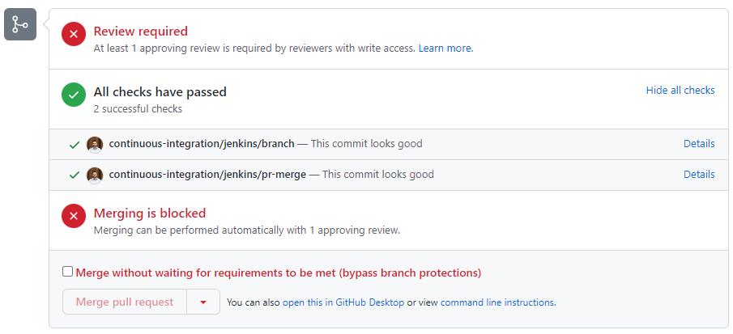

# Infrastructure as Code (IaC)

Use the IaC repository to manage virtual resources on the MNL cloud infrastructure, using GitHub, Jenkins, and Terraform.

## Instructions: How to use this repository

Follow the steps below to interact with the IaC services:

### 1. Clone the IaC repo and create a new branch

Clone the IaC repository locally to your system:

```bash
git clone https://github.com/medianetlab/iac.git
cd iac
```

Create a new branch with your name:

```bash
git checkout -b <YOYR_NAME>
```

If you already have a branch created, merge the master branch into your branch to get the latest updates: 

```bash
git checkout <YOYR_NAME>
git merge master
```

### 2. Update the configuration files

Update the necessary configuration files and commit the changes to your branch. Then push the new commits to your branch on the remote repository. 

```bash
git push origin <YOUR_NAME>
```

This will trigger a Jenkins pipeline on your branch that will verify that the specified changes can be implemented:



### 3. Create a Pull Request to the staging branch

If the Jenkins pipelines finish successfully, create a new pull request to the **staging** branch. Add a detailed description to the pull requess, highlighting the purpose of the infrastructure updates:



An MNL admin will review the pull request and approve the merge into the master branch:



 Merging it into the master branch will trigger the actual IaC services that will implement the specified changes.

Once the master pipeline finishes, you will be notified for the expected infrastructure updates.

## Instructions: Create/Update/Delete Openstack VMs

Follow the steps below to create/update/delete VMs on an Openstack cloud:

* Navigate to the folder containing the configuration files for the Openstack cloud that you want to use, under the [openstack](./openstack/) folder. You can find more details about the available MNL clouds [here](https://github.com/medianetlab/infrastructure/blob/master/Clouds.md).
* Read the instructions in the `README.md` file in the respective openstack folder.
* Update the necessary configurations files following the above instructions